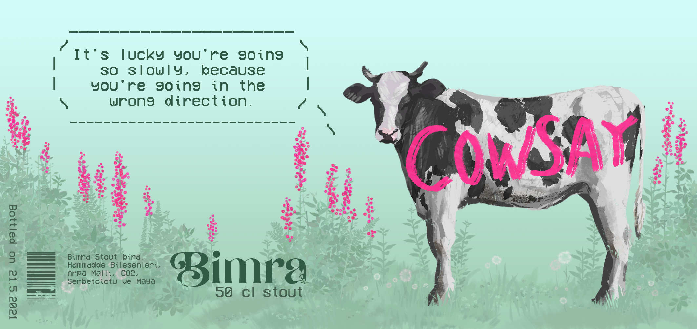

# cowsay_labels

This is a label generator for our homebrew beer. Label template was made in photoshop, and the fortunes are generated using the fortune library.

**500ml label example** 

**250ml label example** 

I just realized it says 50 cl